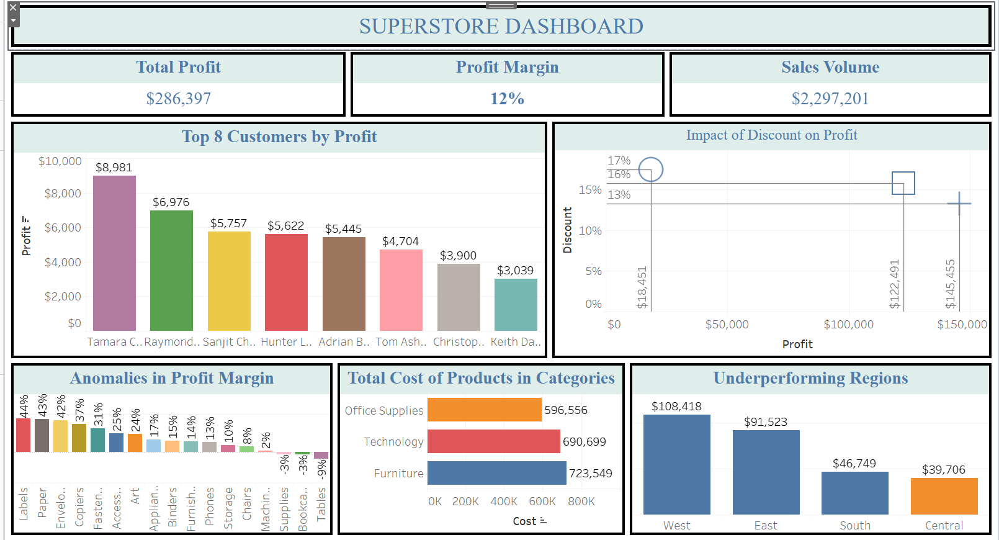

Superstore Sales Performance Dashboard

Project Overview

This project presents an interactive **Superstore Sales Performance Dashboard** built in **Tableau** to analyze sales performance, profitability, customer contributions, product categories, and regional trends. The dashboard transforms raw transactional data into meaningful business insights, enabling stakeholders to monitor key performance indicators (KPIs), evaluate business performance, identify profit drivers, and make informed strategic decisions.

Designed with an executive-friendly layout, the dashboard provides a comprehensive overview of business operations, helping organizations optimize pricing strategies, improve regional performance, strengthen customer relationships, and maximize profitability.

---

Project Objectives

- Monitor overall sales and profit performance.
- Analyze total profit, sales volume, and profit margin.
- Identify the most profitable customers.
- Evaluate the relationship between discounts and profitability.
- Detect product categories with abnormal profit margins.
- Compare product costs across major categories.
- Identify underperforming sales regions.
- Support strategic decision-making through interactive data visualization.

---

Tools Used

- Tableau Desktop
- Microsoft Excel
- Data Cleaning & Preparation
- Interactive Dashboard Design
- Business Intelligence
- Data Visualization

---

Dashboard KPIs

| KPI | Value |
|------|-------|
| 💰 Total Profit | **$286,397** |
| 📈 Profit Margin | **12%** |
| 💵 Sales Volume | **$2,297,201** |

---

Business Insights

### Top Customers by Profit

The dashboard highlights the **Top 8 Customers** who generated the highest profit for the business. The leading customer contributed **$8,981** in profit, while the remaining top customers consistently generated between **$3,000** and **$7,000**. These high-value customers represent an important source of revenue and should remain a priority for customer retention strategies.

---

### Impact of Discounts on Profit

The dashboard demonstrates that increasing discounts does not necessarily result in higher profits. While discounts can stimulate sales, excessive discounting significantly reduces profit margins. Maintaining an optimal pricing strategy is essential for maximizing long-term profitability.

---

### Product Cost Analysis

Among the three major product categories:

- **Furniture** recorded the highest product cost.
- **Technology** followed closely behind.
- **Office Supplies** had the lowest overall cost.

This insight indicates that Furniture requires the highest investment and should be closely monitored to ensure strong profit returns.

---

### Profit Margin Analysis

Several product sub-categories achieved outstanding profit margins exceeding **40%**, while others recorded negative profit margins.

Products such as:

- Tables
- Bookcases
- Supplies

experienced losses, suggesting opportunities to review pricing strategies, supplier costs, and discount policies.

---

### Regional Performance

Regional analysis shows that:

- **West Region** generated the strongest business performance.
- **East Region** maintained healthy profitability.
- **South** and **Central Regions** produced comparatively lower profits, indicating opportunities for sales growth and operational improvement.

---

Business Recommendations

**Strengthen Customer Relationships**

Develop loyalty programs and personalized engagement strategies for the highest-profit customers to improve retention and maximize customer lifetime value.

**Optimize Discount Strategy**

Implement data-driven pricing policies to ensure discounts increase sales without significantly reducing profit margins.

**Improve Low-Profit Products**

Review the pricing, procurement costs, and inventory management of products generating negative profits. Consider supplier negotiations, pricing adjustments, or discontinuing consistently underperforming products.

**Reduce Product Costs**

Since Furniture represents the highest cost category, explore opportunities to optimize procurement processes, reduce logistics costs, and negotiate better supplier pricing.

**Expand Regional Performance**

Develop targeted marketing campaigns and sales strategies for the South and Central regions while maintaining the strong performance achieved in the West and East regions.

---

Dashboard Preview

Click the image below to view the complete interactive dashboard.



---

Dashboard Features

- Executive KPI Cards
- Interactive Tableau Dashboard
- Top Customer Profit Analysis
- Discount vs Profit Analysis
- Profit Margin Analysis
- Product Cost Analysis
- Regional Performance Dashboard
- Executive Business Intelligence Reporting
- Interactive Data Visualization

---

Project Structure

```text
Superstore-Dashboard/
│
├── Data/
│   ├── Superstore_Data.xlsx
│   └── Cleaned_Data.xlsx
│
├── Dashboard/
│   └── Sample data store.twbx
│
├── Images/
│   └── tore.png
│
└── README.md
```

---

Conclusion

The **Superstore Sales Performance Dashboard** demonstrates how Tableau can transform raw business data into meaningful insights that support strategic decision-making. By combining interactive visualizations with key performance indicators, the dashboard enables stakeholders to monitor profitability, evaluate customer performance, optimize pricing strategies, identify operational inefficiencies, and uncover opportunities for sustainable business growth.

This project showcases practical skills in **Tableau**, **Business Intelligence**, **Data Visualization**, **Dashboard Design**, **Data Analysis**, and **Executive Reporting**, making it a valuable portfolio project for Data Analysts, Business Intelligence Analysts, and aspiring Data Professionals.

---

⭐ If you found this project useful, feel free to star this repository and connect with me for more data analytics projects.
